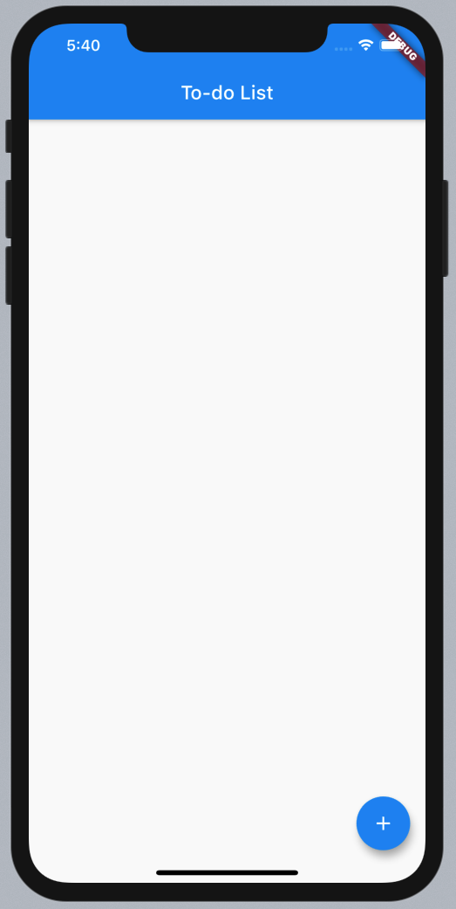
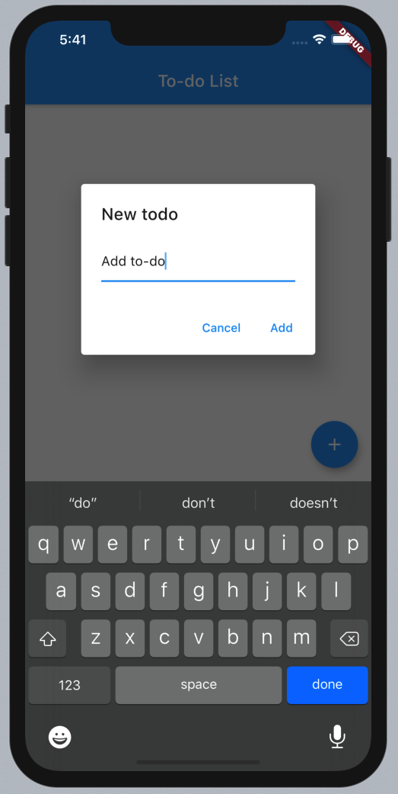
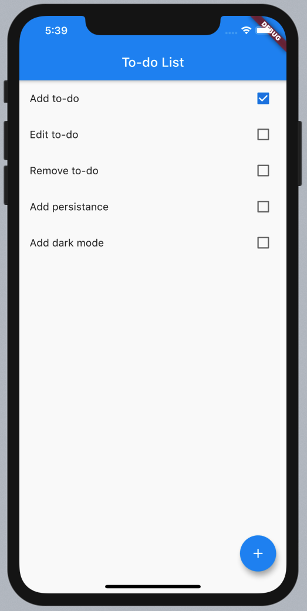

# Flutter To-do List

<p align="center">
    
    
    <a href="https://github.com/RenanArques/flutter-todo-list/commits/master">
      
    </a>
    <a href="https://github.com/RenanArques/flutter-todo-list/blob/master/LICENSE">
      
    </a>
</p>

<p align="center">
  📝 A simple to-do list app to start my Flutter studies
</p>

<p align="center">
  
  
  
</p>

<p align="center">
 <a href="#dart-roadmap">Roadmap</a> •
 <a href="#computer-run">Run</a> •
 <a href="#page_with_curl-licence">Licence</a>
</p>

## :dart: Roadmap

- [x] Add to-do
- [ ] Edit to-do
- [ ] Remove to-do
- [ ] Add dark mode
- [ ] Add persistance

## :computer: Run

### Requirements

- [Git](https://git-scm.com/downloads)
- [Flutter](https://flutter.dev/docs/get-started/install)

Clone this repository:

```sh
$ git clone https://github.com/RenanArques/flutter-todo-list.git
```

In the repository root directory run:

```sh
$ flutter run
```

## :page_with_curl: Licence

This project is under MIT license. See the [LICENSE](LICENSE) file for more details.
